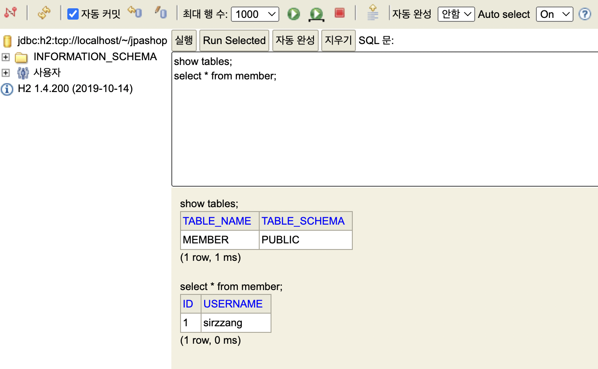

# JPA 설정

* [JPA 설정 관련 문서](https://docs.spring.io/spring-boot/docs/current/reference/html/howto.html#howto.data-access.jpa-properties)

## 어플리케이션 설정

 JPA 설정을 위한 `application.yml` 파일을 작성한다.(*`application.properties`보다 yaml 형식 파일을 선호한다고*)
* `spring.datasource.driver-class-name: org.h2.Driver`: DB 접속 시 h2 드라이버 사용
* `spring.jpa.hibernate.ddl-auto: create`: 애플리케이션 실행 시점에 테이블을 drop하고 다시 생성
* `spring.jpa.hibernate.show_sql: true`: SQL 쿼리 표준 출력
* `logging.level.org.hibernate.sql: debug`: SQL 쿼리 로깅

```yaml
spring:
  datasource:
    url: jdbc:h2:tcp://localhost/~/jpashop
    username: sa
    password:
    driver-class-name: org.h2.Driver

  jpa:
    hibernate:
      ddl-auto: create
    properties:
      hibernate:
        show_sql: true
        format_sql: true

logging:
  level:
    org.hibernate.SQL: debug
    org.hibernate.type: trace # 쿼리 파라미터
```

> `MVCC=true` 옵션
> 
> 강의에서는 `spring.datasource.url`의 값을 `jdbc:h2:tcp://localhost/~/jpashop;MVCC=true`로 설정했는데, 아래와 같은 에러가 나서 삭제했다.
> ```java
> Failed to load ApplicationContext
> java.lang.IllegalStateException: Failed to load ApplicationContext
> ```


## 동작 확인

### 예제

 간단한 회원 엔티티 예제를 작성한다.
```java
@Entity
@Getter @Setter
public class Member {

    @Id @GeneratedValue
    private Long id;
    private String username;

}
```
<br>

 간단한 회원 리포지토리를 작성한다.
* `@Repository`: 컴포넌트 스캔 대상. 스프링 빈 등록
* `@PersistentContext`: 스프링 컨테이너가 엔티티 매니저 의존관계 주입
> `save` 시 `id`를 반환하는 것은 개발자의 스타일. 강의자의 경우, 커맨드랑 쿼리를 분리한다고. 저장을 하고 나면, id 정도로 조회만 할 수 있게 한다.

```java
@Repository
public class MemberRepository {

    @PersistenceContext
    private EntityManager em;

    public Long save(Member member) {
        em.persist(member);
        return member.getId();
    }

    public Member find(Long id) {
        return em.find(Member.class, id);
    }
}
```

em.persist -> 집어 넣으면 됨
member가 아니라 id를 반환하는 건 김영한씨 스타일. 커맨드 성이라 리턴 값 거의 안 만드는? id로 조회 정도는 할 수 있게


### 테스트

 작성한 예제에서 회원을 저장하고, 저장한 회원을 id로 조회하는 테스트 클래스를 작성해 보자.
```java
@RunWith(SpringRunner.class)
@SpringBootTest
@Rollback(value = false)
public class MemberRepositoryTest {

    @Autowired MemberRepository memberRepository;

    @Test
    @Transactional
    @DisplayName("회원을 저장한다.")
    public void 회원저장() throws Exception {

        // given
        Member member = new Member();
        member.setUsername("sirzzang");

        // when
        Long savedId = memberRepository.save(member);
        Member findMember = memberRepository.find(savedId);

        // then
        assertThat(findMember.getId()).isEqualTo(member.getId());
        assertThat(findMember).isEqualTo(member);
        System.out.println("findMember == member " + (findMember == member));
    }
}
```

#### `@transactional`

 `EntityManager`를 통한 데이터 변경은 모두 트랜잭션 안에서 이루어져야 한다.
* 스프링 종속적인 어플리케이션을 설계하므로, 스프링의 어노테이션 사용을 권장
* 트랜잭션 설정하지 않으면 아래와 같은 에러 발생
```java
No EntityManager with actual transaction available for current thread - cannot reliably process 'persist' call; nested exception is javax.persistence.TransactionRequiredException: No EntityManager with actual transaction available for current thread - cannot reliably process 'persist' call
org.springframework.dao.InvalidDataAccessApiUsageException: No EntityManager with actual transaction available for current thread - cannot reliably process 'persist' call; nested exception is javax.persistence.TransactionRequiredException: No EntityManager with actual transaction available for current thread - cannot reliably process 'persist' call
```

 실행 후, 아래와 같이 테이블이 생성되는지 확인한다.
```java
2022-04-05 15:42:30.733 DEBUG 12939 --- [    Test worker] org.hibernate.SQL                        :

  drop table if exists member CASCADE
  2022-04-05 15:42:30.743 DEBUG 12939 --- [    Test worker] org.hibernate.SQL                        :

  create table member (
  id bigint not null,
  username varchar(255),
  primary key (id)
  )
```

#### `@Rollback(false)`

 트랜잭션이더라도 테스트에 있으면 테스트 종료 후 트랜잭션이 자동으로 롤백된다. 롤백을 막고 실제로 데이터가 저장되는지 확인하고 싶으면, `@Rollback` 어노테이션을 이용해 롤백을 막는다.


#### 영속성 컨텍스트

 저장한 회원과 조회한 회원이 같은지 확인해 보자.
* `equals`, `hashcode` 재정의한 것이 없기 때문에, `==`을 이용해 동등 비교
* Assertj Assertions의 `isEqualTo`로도 확인 가능
```java
assertThat(findMember).isEqualTo(member);
System.out.println("findMember == member " + (findMember == member));
```
 
 실행 결과를 보면, 동일한 것을 알 수 있다.
```java
2022-04-05 15:52:13.239 DEBUG 13026 --- [    Test worker] org.hibernate.SQL                        :
call next value for hibernate_sequence
Hibernate:
call next value for hibernate_sequence
findMember == member true
```
<br>
 같은 트랜잭션 안에서 저장하고 조회하면, 영속성 컨텍스트가 같기 때문이다. 같은 영속성 컨텍스트 안에서는 식별자(`id`)가 같으면, 같은 엔티티로 식별한다.

 로그를 확인하면, 영속성 컨텍스트가 같고, 식별자도 같기 때문에 조회 쿼리도 실행되지 않는다. 같은 영속성 컨텍스트이므로, 1차 캐시에서 꺼내오면 된다.
```java
2022-04-05 16:41:02.660 DEBUG 13282 --- [    Test worker] org.hibernate.SQL                        :
        insert
        into
        member
        (username, id)
        values
        (?, ?)
        Hibernate:
        insert
        into
        member
        (username, id)
        values
        (?, ?)
        2022-04-05 16:41:02.664 TRACE 13282 --- [    Test worker] o.h.type.descriptor.sql.BasicBinder      : binding parameter [1] as [VARCHAR] - [sirzzang]
        2022-04-05 16:41:02.665 TRACE 13282 --- [    Test worker] o.h.type.descriptor.sql.BasicBinder      : binding parameter [2] as [BIGINT] - [1]
        2022-04-05 16:41:02.669  INFO 13282 --- [    Test worker] o.s.t.c.transaction.TransactionContext   : Committed transaction for test: [DefaultTestContext@5d332969 testClass = MemberRepositoryTest, testInstance = jpabook.jpashop.MemberRepositoryTest@aca594d, testMethod = 회원저장@MemberRepositoryTest, testException = [null], mergedContextConfiguration = [WebMergedContextConfiguration@7cc9ce8 testClass = MemberRepositoryTest, locations = '{}', classes = '{class jpabook.jpashop.JpashopApplication}', contextInitializerClasses = '[]', activeProfiles = '{}', propertySourceLocations = '{}', propertySourceProperties = '{org.springframework.boot.test.context.SpringBootTestContextBootstrapper=true}', contextCustomizers = set[org.springframework.boot.test.autoconfigure.actuate.metrics.MetricsExportContextCustomizerFactory$DisableMetricExportContextCustomizer@7cbc3762, org.springframework.boot.test.autoconfigure.properties.PropertyMappingContextCustomizer@0, org.springframework.boot.test.autoconfigure.web.servlet.WebDriverContextCustomizerFactory$Customizer@7e7b159b, org.springframework.boot.test.context.filter.ExcludeFilterContextCustomizer@1dd6d4b7, org.springframework.boot.test.json.DuplicateJsonObjectContextCustomizerFactory$DuplicateJsonObjectContextCustomizer@784c3487, org.springframework.boot.test.mock.mockito.MockitoContextCustomizer@0, org.springframework.boot.test.web.client.TestRestTemplateContextCustomizer@1c3b9394, org.springframework.boot.test.context.SpringBootTestArgs@1, org.springframework.boot.test.context.SpringBootTestWebEnvironment@2f40e5db], resourceBasePath = 'src/main/webapp', contextLoader = 'org.springframework.boot.test.context.SpringBootContextLoader', parent = [null]], attributes = map['org.springframework.test.context.web.ServletTestExecutionListener.activateListener' -> true, 'org.springframework.test.context.web.ServletTestExecutionListener.populatedRequestContextHolder' -> true, 'org.springframework.test.context.web.ServletTestExecutionListener.resetRequestContextHolder' -> true]]
        2022-04-05 16:41:02.696  INFO 13282 --- [extShutdownHook] o.s.s.concurrent.ThreadPoolTaskExecutor  : Shutting down ExecutorService 'applicationTaskExecutor'
        2022-04-05 16:41:02.697  INFO 13282 --- [extShutdownHook] j.LocalContainerEntityManagerFactoryBean : Closing JPA EntityManagerFactory for persistence unit 'default'
        2022-04-05 16:41:02.698 TRACE 13282 --- [extShutdownHook] o.h.type.spi.TypeConfiguration$Scope     : Handling #sessionFactoryClosed from [org.hibernate.internal.SessionFactoryImpl@40a28bda] for TypeConfiguration
        2022-04-05 16:41:02.698 DEBUG 13282 --- [extShutdownHook] o.h.type.spi.TypeConfiguration$Scope     : Un-scoping TypeConfiguration [org.hibernate.type.spi.TypeConfiguration$Scope@4c52ba4b] from SessionFactory [org.hibernate.internal.SessionFactoryImpl@40a28bda]
        2022-04-05 16:41:02.701  INFO 13282 --- [extShutdownHook] com.zaxxer.hikari.HikariDataSource       : HikariPool-1 - Shutdown initiated...
        2022-04-05 16:41:02.716  INFO 13282 --- [extShutdownHook] com.zaxxer.hikari.HikariDataSource       : HikariPool-1 - Shutdown completed.

```


## 쿼리 파라미터 로그 남기기

JPA 쓰면 SQL 쿼리 날아가고 데이터베이스 연결 등 시점 확인 어려움. 로그에도 쿼리 파라미터가 ?로 남음

### 어플리케이션 설정 변경

 `application.yml`에서 쿼리 파라미터가 남도록 로깅 설정을 변경한다.

```yaml
logging:
  level:
    org.hibernate.SQL: debug
    org.hibernate.type: trace # 쿼리 파라미터
```

 설정 후 실행 시, 로그에 파라미터 정보가 남는 것을 확인할 수 있다.
```java
2022-04-05 16:16:30.895 TRACE 13204 --- [    Test worker] o.h.type.descriptor.sql.BasicBinder      : binding parameter [1] as [VARCHAR] - [sirzzang]
2022-04-05 16:16:30.896 TRACE 13204 --- [    Test worker] o.h.type.descriptor.sql.BasicBinder      : binding parameter [2] as [BIGINT] - [1]
```

### 외부 라이브러리 추가

 [spring-boot-data-source-decorator](https://github.com/gavlyukovskiy/spring-boot-data-source-decorator)와 같은 외부 라이브러리를 사용한다.

* `build.gradle`에 라이브러리 추가: `implementation 'com.github.gavlyukovskiy:p6spy-spring-boot-starter:1.5.6'`

> 쿼리 파라미터를 로그로 남기는 외부 라이브러리는 시스템 자원을 사용하므로, 개발 단계에서는 편하게 사용해도 되지만, 운영 적용 시 성능 테스트를 진행하는 것이 좋다.